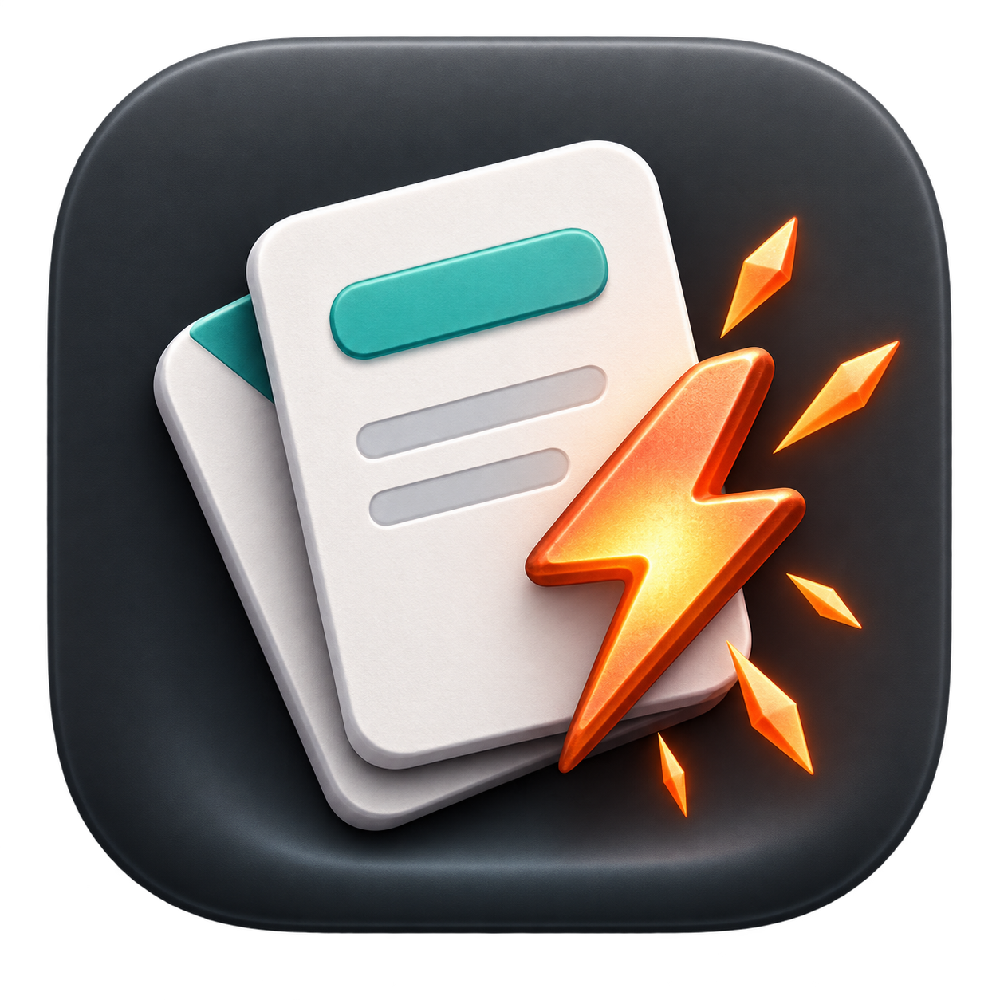
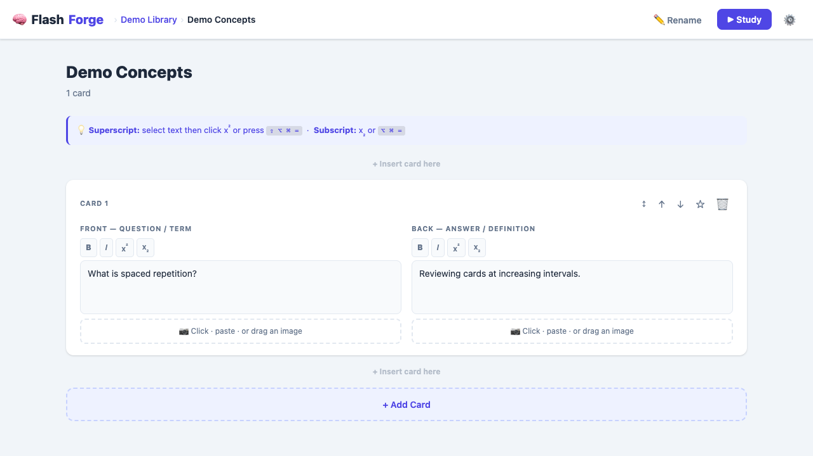

# FlashForge

FlashForge is a private, offline-first flashcard app for macOS. It combines a native AppKit/WebKit shell with a focused study interface and keeps all card data on the user's Mac.





## Features

- Organise flashcards into colour-coded folders and sets
- Create, edit, reorder, star, and delete cards
- Add compressed images by picker, paste, or drag and drop
- Use bold, italic, superscript, and subscript formatting
- Study full sets or focused subsets: weak, unseen, starred, or last missed
- Resume interrupted sessions and undo the latest answer
- Track per-card mastery and session history
- Customise appearance, accent colour, text size, mastery rules, and shortcuts
- Import Quizlet text and portable FlashForge set files
- Create and restore complete JSON backups, including images and statistics
- Work entirely offline with local WebKit storage

## Architecture

The native layer provides the macOS window, menus, file panels, downloads, lifecycle handling, and a stable WebKit data container. The bundled web layer contains the mature study experience and persists text in `localStorage` and card images in IndexedDB.

See [Documentation/ARCHITECTURE.md](Documentation/ARCHITECTURE.md) for the component map and data model.

## Build

Requirements:

- macOS 13 or newer
- Swift 6 / Xcode 16 Command Line Tools or newer

```bash
swift test
./Scripts/build-app.sh
open dist/FlashForge.app
```

The build script creates an ad-hoc signed app at `dist/FlashForge.app`. Open `Package.swift` in Xcode to browse, build, and debug the project. Distribution outside a developer machine requires an Apple Developer ID signature and notarisation.

## Restore Existing Data

On first launch, choose **Restore Backup** and select a `flashforge-backup-YYYY-MM-DD.json` file. Personal backup files are deliberately ignored by Git and are never bundled into the application.

For a new, empty installation, the same migration can be started from Terminal:

```bash
open -a FlashForge --args --migrate-backup /path/to/flashforge-backup.json
```

The command validates the backup and restores it automatically only when the app has no existing folders. Otherwise, FlashForge shows the normal replacement preview.

## Privacy

FlashForge has no accounts, analytics, adverts, or network services. Cards, images, settings, and study history stay in the app's local WebKit data store unless the user exports a backup.

## License

Copyright 2026 MYLO175. All rights reserved. The source is public for portfolio viewing only; see [LICENSE](LICENSE) for the full terms.
